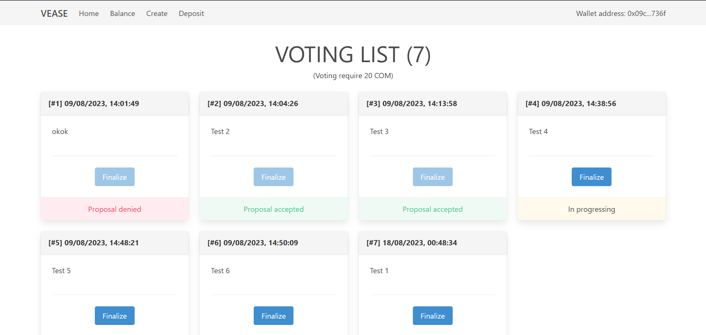
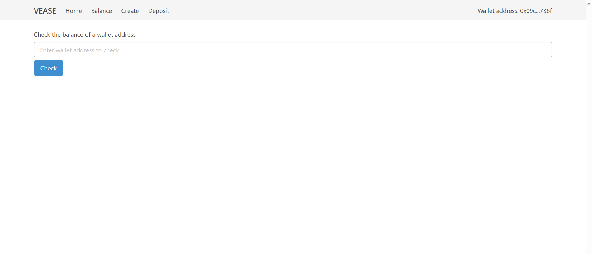
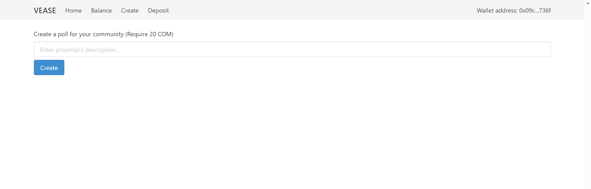
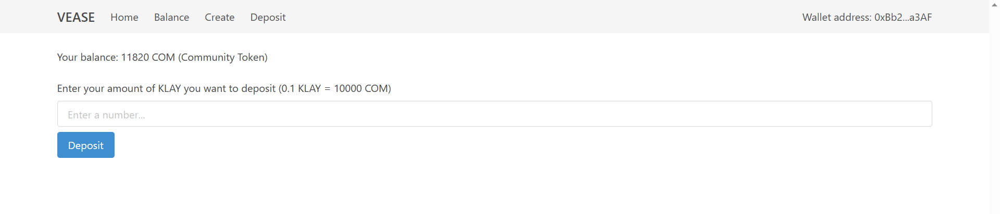

# Vease

Vease is a decentralized voting app that minimize the gas fee.

&ensp;This is a [Next.js](https://nextjs.org/) project bootstrapped with [`create-next-app`](https://github.com/vercel/next.js/tree/canary/packages/create-next-app).

## Demo
<p align="center">
    
    
    
    
</p>

## Installation

Clone the project then extract and run terminal

```bash
npm install
npm run dev
```

## Usage
Open [http://localhost:3000](http://localhost:3000) with your browser to see the result.

For all the function works, you have to have a Metamask wallet and [connect](https://docs.klaytn.foundation/content/dapp/tutorials/connecting-metamask) to Baobab network (Klaytn Testnet) then [faucet](https://baobab.wallet.klaytn.foundation/faucet) an test amount of KLAY to wallet.


## Contributing

Pull requests are welcome. For major changes, please open an issue first
to discuss what you would like to change.

Please make sure to update tests as appropriate.

## License

[MIT](https://choosealicense.com/licenses/mit/)